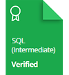

    

# Resoluções | HackerRank

Este repositório consiste em compartilhar minhas soluções para os desafios desenvolvidos pelo <a href="https://www.hackerrank.com"> HackerRank </a>

# Perfil pessoal

[View Profile](https://www.hackerrank.com/diegomcs)

# Certificados

# Insígnias

## Desafios

### - SQL

|   Categoria    |            Desafio             | Dificuldade | Pontuação obtida |                                       Problema                                       |                                                 Solução                                                 |
| :------------: | :----------------------------: | :---------: | :--------------: | :----------------------------------------------------------------------------------: | :-----------------------------------------------------------------------------------------------------: |
| Seleção básica |    Revising Select Query I     |    Fácil    |        10        |   [Link](https://www.hackerrank.com/challenges/revising-the-select-query/problem)    |   [Link](https://www.hackerrank.com/challenges/revising-the-select-query/submissions/code/244350597)    |
| Seleção básica |    Revising Select Query II    |    Fácil    |        10        |  [Link](https://www.hackerrank.com/challenges/revising-the-select-query-2/problem)   |  [Link](https://www.hackerrank.com/challenges/revising-the-select-query-2/submissions/code/244350699)   |
| Seleção básica |           Select ALL           |    Fácil    |        10        |         [Link](https://www.hackerrank.com/challenges/select-all-sql/problem)         |         [Link](https://www.hackerrank.com/challenges/select-all-sql/submissions/code/244350814)         |
| Seleção básica |          Select By ID          |    Fácil    |        10        | [Link](https://www.hackerrank.com/challenges/select-by-id/problem?isFullScreen=true) |          [Link](https://www.hackerrank.com/challenges/select-by-id/submissions/code/244350907)          |
| Seleção básica |  Japanese Cities' Attributes   |    Fácil    |        10        |   [Link](https://www.hackerrank.com/challenges/japanese-cities-attributes/problem)   |   [Link](https://www.hackerrank.com/challenges/japanese-cities-attributes/submissions/code/244350975)   |
| Seleção básica |     Japanese Cities' Names     |    Fácil    |        10        |      [Link](https://www.hackerrank.com/challenges/japanese-cities-name/problem)      |      [Link](https://www.hackerrank.com/challenges/japanese-cities-name/submissions/code/244366035)      |
| Seleção básica | Weather Observation Station 1  |    Fácil    |        15        | [Link](https://www.hackerrank.com/challenges/weather-observation-station-1/problem)  | [Link](https://www.hackerrank.com/challenges/weather-observation-station-1/submissions/code/244366147)  |
| Seleção básica | Weather Observation Station 3  |    Fácil    |        10        | [Link](https://www.hackerrank.com/challenges/weather-observation-station-3/problem)  | [Link](https://www.hackerrank.com/challenges/weather-observation-station-3/submissions/code/244367159)  |
| Seleção básica | Weather Observation Station 4  |    Fácil    |        10        | [Link](https://www.hackerrank.com/challenges/weather-observation-station-3/problem)  | [Link](https://www.hackerrank.com/challenges/weather-observation-station-4/submissions/code/244371321)  |
| Seleção básica | Weather Observation Station 5  |    Fácil    |        30        | [Link](https://www.hackerrank.com/challenges/weather-observation-station-5/problem)  | [Link](https://www.hackerrank.com/challenges/weather-observation-station-5/submissions/code/244476513)  |
| Seleção básica | Weather Observation Station 6  |    Fácil    |        10        | [Link](https://www.hackerrank.com/challenges/weather-observation-station-6/problem)  | [Link](https://www.hackerrank.com/challenges/weather-observation-station-6/submissions/code/244483416)  |
| Seleção básica | Weather Observation Station 7  |    Fácil    |        10        | [Link](https://www.hackerrank.com/challenges/weather-observation-station-7/problem)  | [Link](https://www.hackerrank.com/challenges/weather-observation-station-7/submissions/code/244489730)  |
| Seleção básica | Weather Observation Station 8  |    Fácil    |        15        | [Link](https://www.hackerrank.com/challenges/weather-observation-station-8/problem)  | [Link](https://www.hackerrank.com/challenges/weather-observation-station-8/submissions/code/244494232)  |
| Seleção básica | Weather Observation Station 9  |    Fácil    |        10        | [Link](https://www.hackerrank.com/challenges/weather-observation-station-9/problem)  | [Link](https://www.hackerrank.com/challenges/weather-observation-station-9/submissions/code/244489158)  |
| Seleção básica | Weather Observation Station 10 |    Fácil    |        10        | [Link](https://www.hackerrank.com/challenges/weather-observation-station-10/problem) | [Link](https://www.hackerrank.com/challenges/weather-observation-station-10/submissions/code/244494799) |
| Seleção básica | Weather Observation Station 11 |    Fácil    |        15        | [Link](https://www.hackerrank.com/challenges/weather-observation-station-11/problem) | [Link](https://www.hackerrank.com/challenges/weather-observation-station-11/submissions/code/244496467) |
| Seleção básica | Weather Observation Station 12 |    Fácil    |        15        | [Link](https://www.hackerrank.com/challenges/weather-observation-station-12/problem) | [Link](https://www.hackerrank.com/challenges/weather-observation-station-12/submissions/code/244496491) |
| Seleção básica |      Higher Than 75 Marks      |    Fácil    |        15        |       [Link](https://www.hackerrank.com/challenges/more-than-75-marks/problem)       |       [Link](https://www.hackerrank.com/challenges/more-than-75-marks/submissions/code/244605269)       |
| Seleção básica |         Employee Names         |    Fácil    |        10        |       [Link](https://www.hackerrank.com/challenges/name-of-employees/problem)        |       [Link](https://www.hackerrank.com/challenges/name-of-employees/submissions/code/244507634)        |
| Seleção básica |       Employee Salaries        |    Fácil    |        10        |      [Link](https://www.hackerrank.com/challenges/salary-of-employees/problem)       |      [Link](https://www.hackerrank.com/challenges/salary-of-employees/submissions/code/244508466)       |
