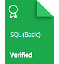

    

Este repositório consiste em compartilhar minhas certificações para os desafios desenvolvidos pelo <a href="https://www.hackerrank.com"> HackerRank. </a>

# Perfil pessoal

[View Profile](https://www.hackerrank.com/diegomcs)

# Certificados

# Insígnias

